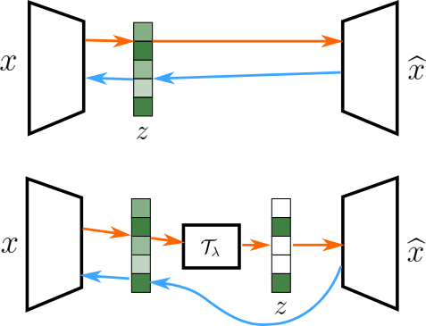

# Variational Sparse Coding

<p align="center">

</p>

## Dependencies
* Python 3.9.6
* PyTorch 1.10.1
* Torchvision 0.11.2
* pyitlib 0.2.2

## Training

The modules in this code are written to generalize to arbitrary inference strategies and generators. To get a direct peek at how different methods infer sparse codes, refer to `./model/reparameterization.py` and `./model/vi_encoder.py`. Classic MAP estimators are included in `./utils/solvers.py`, with an automatic differentiation version of FISTA available in `./model/util.py`.

### Linear Generator

`train_vsc_dict.py` is the main training script for training a linear generator with whitened image patches. Note that this dataset must be manually downloaded from [http://www.rctn.org/bruno/sparsenet/](http://www.rctn.org/bruno/sparsenet/) (labeled as whitened natural scenes) and placed in a folder labeled `./data/`. The training script takes as input a .json config file (all methods from paper included in the `dict_config` folder). To start a training run, use the following command:

```
python train_vsc_dict.py -c dict_config/[CONFIG_FILE]
```

All config files needed to reproduce paper results are included. Use the below table (for `solver_args`) to create new config files for additional experiments:

| Argument           | Valid Values     | Notes          |
| --------------     | --------------   | -------------- |
| solver             | FISTA, VI        | Whether to use FISTA or a DNN inference network to infer sparse codes |
| lambda_            | (0, inf)         | Lambda parameter used for FISTA and to compute validation loss for VI methods |
| true_coeff         | true, false      | Whether to use FISTA codes to train dictionary (good for debugging) |
| debug              | true, false      | Extra debugging each epoch |
| sample_method      | max, avg, iwae   | How to use samples to compute ELBO (avg is standard VI) |
| num_samples        | [1, inf)         | Sampling budget for each training iteration |
| threshold          | true, false      | Whether to sample samples drawn from base distribution |
| threshold_lambda   | (0, inf)         | The lambda value used for shifted soft-thresholded the base distribution (if applicable) |
| theshold_learn     | true, false      | Whether to learn the threshold parameter with a Gamma prior |
| gamma_kl_weight    | true, false     | Additional multiplicative factor on KL for the Gamma prior (if applicable) |
| estimator          | straight, subg   | Whether to use a straight-through estimator or subgradients for the soft-threshold |
| prior_distribution | gaussian, laplacian, concreteslab | Prior and variational family for base distribution |
| prior_method       | fixed, vamp, clf | How to compute KL. Fixed uses fixed prior weights (standard VI). Vamp and clf use the VampPrior and Clf prior, respectively.|
| spread_prior       | (0, inf)         | Spread parameter for prior (used when prior_method is fixed) |
| spike_prior        | (0, 1]           | Spike prior (only used for concreteslab prior) |
| temp_min           | (0, inf)         | Temperature minimum for Gumbel-Softmax (only used for concreteslab prior) |
| kl_weight          | [0, inf)         | Weight on KL divergence term in ELBO |

### DNN Generator

`train_vsc_celeb.py` is the main training script for training a DNN generator on the CelebA dataset. CelebA must be manually downloaded from [https://mmlab.ie.cuhk.edu.hk/projects/CelebA.html](https://mmlab.ie.cuhk.edu.hk/projects/CelebA.html) and placed in a folder labeled `./data/celeba`. The training script takes as input a .json config file (examples found in the `celeba_config` folder). To start a training run, use the following command:

```
python train_vsc_celeb.py -c celeba_config/[CONFIG_FILE]
```

The config files are structured nearly the same as in the linear generator. Most notably, the DNN generator has the option to use automatic mixed precision (AMP) and multiple GPUs if available. If not, pass a single device id in `train_args`, still wrapped in a list.

## Reproducing Figures

To reproduce results from Table 1, use `vsc_dict_plotting.ipynb`. The script `compute_vsc_statistics.py` can be used to measure multi-information, posterior collapse, and coefficient collapse. Note that this script is automatically run at the end of each training run. To run this command, one can feed the filepath leading to a complete training run as an argument:
```
python compute_vsc_statistics -r PATH_TO_RUNFILE
```
All logs will be included in the path input in a file labeled `statistics.log`.

Full dictionaries (like seen in Figure 3) are automatically generated for each training run in the respective folder.


Data from Figure 4 can be generated from `computed_snr_dict.py` and `computed_snr_inference.py` for the generator and inference network, respectively. The top of these scripts has the file paths for run data hardcoded as strings. These can be edited to validate different runs. The output of this file is sent to a .txt file in `./figures/snr`. This data can be manually entered at the end of `vcs_dict_plotting.ipynb` to reproduce Figure 4.


Figure 5 can be generated with `vsc_jaccard.ipynb`. This noteback hardcodes the file path for training runs as strings near the beginning.

Figures 7 can be generated with `vsc_celeba_validation.ipynb`.


Figures 6 & 8 can be generated with `vsc_celeba_dict_est.ipynb`.

## Under Development
There are a lot of extra features in this code developed throughout this research project. Feel free to explore the source to run new experiments you see fit. The following features are under development and are not gauranteed to work:
* LISTA
* ADMM Solvers for MAP Estimates
* Variational Rejection Sampling
* A Core-set prior as an alternative to the VampPrior or Clf prior
* A FISTA generative model that applies FISTA inference through a DNN generator (i.e., sparse VAE with no encoder)
